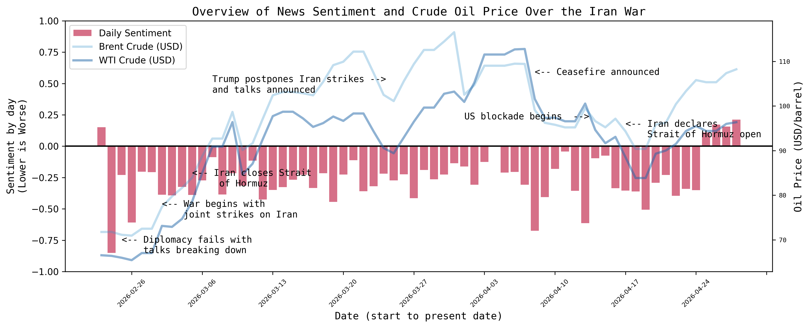
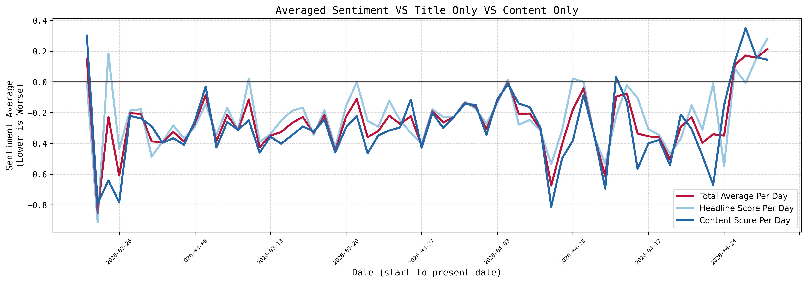
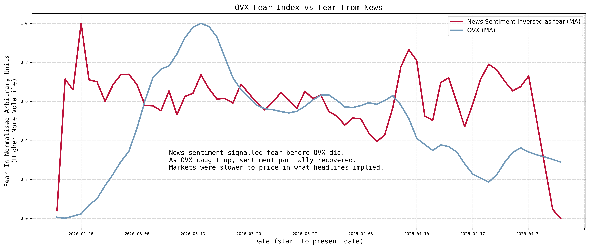
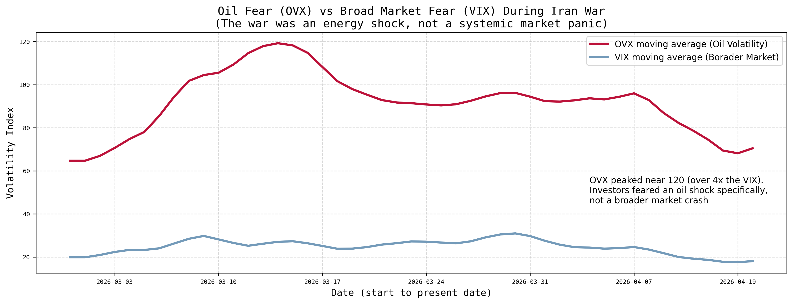
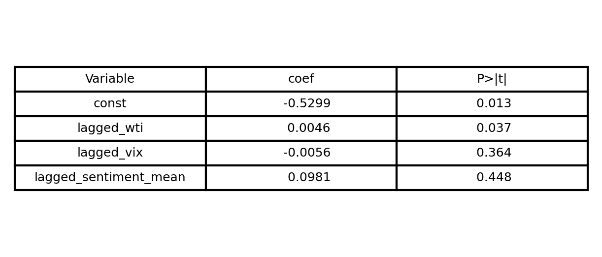
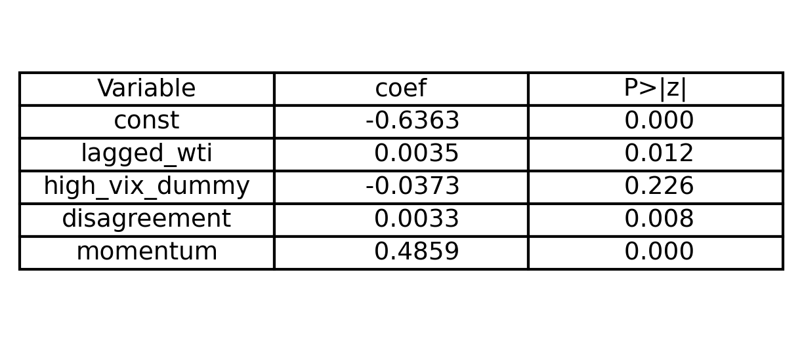

## Introduction

The Iran war formally began on the 28th February 2026 after US strikes on Iran, and as many investors feared, it has had major implications on the global supply of oil. This mainly centres on Iran’s hold of the Strait of Hormuz, a narrow waterway through which 20 million barrels of oil previously passed through each day. This amounted to a pre-war daily average of 138 ships passing through daily. However, as the conflict progressed, and with the strait shutting, the daily numbers of ships passing through the strait often failed to reach even double digits, a far cry from pre-war figures. This lack of traffic through the strait has caused major oil price hikes and supply constraints, as well as widespread fear in both front-page news and financial markets.

```{python}

import folium
m = folium.Map(location=[26.5945,56.4720], zoom_start=4)

folium.Marker(
    location=[26.5945,56.4720],
    tooltip=folium.Tooltip('The Strait of Hormuz', permanent=True),
    icon=folium.Icon(color='red')
).add_to(m)

m
```
*An interactive map of the Strait of Hormuz, please zoom in!*

The events of this war and the ensuing oil shock, along with its implications on the broader markets, have been covered heavily by news agencies. What if we could easily track how it is covered, by calculating how positive or negative the news is, i.e. the news sentiment? This blog therefore aims to create the necessary code and then discuss the findings of this research question:

***How has market sentiment changed with oil over the course of the 2026 Iran war?***

We will see if sentiment aligns well with key events, if it can be used as a measure of fear, its relation with oil, and what factors, if any, can help us predict tomorrow’s sentiment.

In order to do this, we have done the following:

* Collect relevant news stories and financial data from API’s.
* Use NLP models to calculate sentiment scores.
* Explore any relationships through graphs and regression modelling.

::: {.callout-note}
**Please note:** The code has not been run since my project upload date, thus it will not contain details of relevant events post this date.
:::

## Collecting Data

Ideally, a single paid API could have provided all the data for this project. But for the sake of replicability (and cost), all APIs chosen were free. However, when navigating each free news API, each had its own limitations, thus we used three in combination.

* The Guardian Open Platform API was the first used. It is completely free of charge, and allows custom searches back to the war’s start date (we searched for Iran, oil, markets etc). It returns both headlines and body text in a dictionary, where BeautifulSoup was required for HTML parsing of the tags in the body text. However, it did not give us access to the most recent articles.

* Alpha Vantage was used to get the most recent news headlines and summaries from articles on the war and markets through its NEWS_SENTIMENT endpoint. It allows us to search via predefined categories (we chose energy_transportation, financial_markets, economy_macro, and finance).

* Finally, NewsAPI was used as it scrapes data from 150,000 worldwide sources, providing excellent news data. However, the free tier only goes back one month, thus we ran the script daily to keep appending to a CSV and build up a dataset that goes beyond the one-month limit.

::: {.callout-tip}
If I were doing this again, those paid APIs would really help. They vary by cost, but an API with an excellent archive feature would do brilliantly here. It would also save us from having to continuously build up our own databases to get around limits!

A paid API may also get data from more financial sources, increasing quality, or the diversity of sources in general, reducing bias.
:::

For data on financial markets, yfinance was used to collect Brent and WTI Crude oil prices daily, as well as CBOE Crude Oil Volatility Index (OVX) values, CBOE Volatility Index (VIX) values, and data on the S&P 500 index. These will provide data on oil throughout the conflict, as well as broader market volatility. A reusable function was built to get the data, calculate an average daily price (of its open and close price), and to fill any non-trading days with the previous day's closing price using ffill().

### Ensuring Relevance

Even with our targeted searches on the conflict and markets, some irrelevant articles were getting through. To address this, we filtered by relevance using a sentence transformer. The all-MiniLM-L6-v2 model was chosen, and each article headline was compared against an embedded reference sentence describing the topic. Articles below a certain cosine similarity (a measure of similarity between the meaning of two items) were then discarded, as they would have just caused noise that would have affected our accuracy in tracking the war’s events.

### Sentiment Calculations

For the sentiment analysis itself, we chose the ProsusAI/FinBERT model. It is pre-trained on 4.9 billion tokens of financial text and has an accurate understanding of financial language and context. It returns the probability of the text being positive, neutral, or negative. This was converted into a single score, by taking the positive likelihood as a positive score, the negative as a negative score, and neutral as 0. The model was then run over each headline and article text, and an average was then made.

::: {.callout-note}
Data processing was handled with both Python and SQL, with SQL being used to transform columns via functions such as LAG to find percentage changes and moving averages. This could have been done in Python, but to showcase proficiency with SQL, I felt this was the best way to fit it in.
:::

## Data findings

The chart below provides an overview of sentiment over the course of the war, as well as both Brent and WTI Crude oil prices. Both Brent and WTI are shown as they represent benchmarks for the EMEA and US regions respectively.

{width=100% fig-align="center"}

Immediately, we can see sustained negative sentiment since the start of the war. This reflects coverage of the collapsing traffic through the Strait of Hormuz, as well as oil supply constraints and its economic implications. We also see that oil rose roughly 55%, moving from below $70 USD to over $110 USD per barrel at multiple points during the conflict.

Figure 1 also marks some key events that our model picked up, which caused major swings in sentiment (better seen in Figure 2). Firstly, we can see the initial breakdown of talks and the start of the conflict, marked by a dramatic negative shift at the start. Trump’s announcement of talks had a small but short-lived effect. The ceasefire announcement, followed by the US naval blockade of the strait, caused another large negative sentiment swing. We can also see these events aligning well with oil prices.



Exploring sentiment by itself, we again see sustained negative sentiment followed by those sharp swings, which are clearer to see now. When comparing the sentiment of headlines alone, against article text alone and an average of the two, we see that article text (content) was consistently more negative in their scores. This is interesting as we would have expected headlines to be more extreme as journalists attempt to draw attention to the article. However, the headlines could reflect the facts, such as ‘the Strait has been shut’, and then the content could contain a lot more speculation on the effects of this (which are likely negative). For our later analysis, we used the average of headlines and article text.



One area of research was comparing our sentiment analysis to other measures of fear. Here we show the CBOE Crude Oil Volatility Index (OVX), which measures the expected 30-day volatility of crude oil. It is used as a ‘fear gauge’ surrounding oil. We compare this to an inverted sentiment score, so that higher is more fearful, aligning with OVX values.

We see that sentiment ‘fear’ preceded OVX values, with ‘fear’ already being high before OVX spiked. This reflects that public information and speculation about the conflict was already being shared in the news, and that it took time for markets to fully price it in. As OVX caught up, news fear had fallen slightly. We also see that sentiment fear spikes well before any OVX movement at the announcement of the US naval blockade. Perhaps journalists and investors interpret events differently.



We now compare OVX to the CBOE Volatility Index (VIX), which acts as a broader ‘fear gauge’ for the entire market. We can clearly see a huge difference, with OVX being consistently higher than the VIX throughout. Additionally, OVX spiked at nearly 120, over 4x the value of the VIX. This reflects that investors feared an oil shock, not a broader market crash.


Comparing sentiment scores (inverted again) to WTI oil values, we can see if oil has an impact on today’s sentiment. We see a trend similar to sentiment and OVX, with sentiment already being fearful. This again reflects that sentiment in news shifts as events unfold, whereas markets take a little longer to price it in.

## Regression Modeling

In order to substantiate our findings, we use regression modelling. However, as many items studied are related, such as oil values and OVX, we had to be careful not to introduce a lot of multicollinearity in our testing. We started with a ‘dumb’ model as an initial exploration, before making improvements on it.

### Initial Naive Model

Our first model attempts to predict today’s sentiment using yesterday’s oil price, yesterday’s market fear, and yesterday’s sentiment. There is little data transformation occurring beyond lagged values as this is intended as an initial exploration to build upon.



The naive model fails. The R^2^ of 9% collapses to 5% when using adjusted R^2^, reflecting that we explain little of the variation in daily average sentiment. No variables are statistically significant, other than lagged WTI values, although its coefficient was incredibly small. Clearly, oil prices alone do not drive news sentiment, there is far greater depth.

:::{.callout-note}
**Note:** These regression tables will autoupdate from the code! (and so will the graphs).
:::

### Improved Model

This model attempts to improve upon the first model in four key ways.

* **Disagreement:** When sources disagree about events, with some more fearful than others, can this help predict tomorrow’s tone? Disagreement is measured as the standard deviation of sentiment scores multiplied by article count, this captures both the sentiment spread and the volume of coverage.

* **Momentum:** Does sentiment persist? For example, if yesterday was highly negative, is today also likely to be? This is measured as how fast sentiment is changing and in what direction.

* **Market regime:** A dummy/binary variable set to 1 if the VIX was high, or 0 if the VIX was low.

* **HC3:** Improving the model with HC3 robust errors, which are shown to perform better in smaller sample sizes.



With this model we see a massive improvement, with our R^2^ increasing to 62% and our adjusted R^2^ to 54%. The model is also highly jointly significant.

Momentum is statistically significant and has a coefficient of 0.4859. Thus, yesterday’s sentiment is a strong predictor of today’s, which makes sense as the conflict was ongoing. Disagreement was also statistically significant, with a coefficient of 0.0033. When journalists have conflicting views, the sentiment tends to be more positive, whereas if journalists agree, the sentiment is more negative. This does make sense intuitively, as a clear negative event gives less room for speculation.

The high VIX dummy was statistically insignificant, suggesting broader market fears do not alter oil-related financial sentiment. This links to figure 4, as again the war was largely perceived as an energy shock not a broader market shock.

Interestingly, when the dependent variable is swapped for WTI, and lagged WTI is swapped for lagged sentiment mean in the independent variables, we also produce interesting results. Despite only producing an R^2^ of 21% (and an Adj. R^2^ of 15%), a couple of the variables were statistically significant. The high vix dummy, and lagged sentiment mean were both statistically significant in predicting today’s oil prices. This makes sense, as there is a sort of simultaneous relationship between news and prices. When prices swing, sentiment shifts. But when sentiment swings, markets also price this in. The high vix dummy being significant here suggests oil price itself does fluctuate in periods of broader volatility.

## Limitations

Our main issue was our sample size. As we conducted our study over the course of the Iran conflict to the time of publication, we are limited in our sample size. However, we still obtain statistically significant results. Headline news stories may also be intentionally extreme, thus affecting sentiment, which is why we only used the average in our analysis. The APIs we had access to may not be representative globally, and may be biased.

::: {.callout-tip}
Additional improvements in a later study could be to move into intraday prices and sentiment, not just daily. A study linked to ship traffic through the Strait of Hormuz would also be really interesting!
:::

## Conclusions

Overall, our study has accomplished its goals, while also demonstrating how Python and SQL, along with NLP models, can deliver valuable data driven insights into financial data and news.

The main conclusions we can take away are the following:

* The sentiment that we calculated tracks market events, correctly identifying events such as the US naval blockade or when peace talks were announced.

* Sentiment can be predicted, although oil prices alone explain little of the variation as there are many wider aspects that contribute. This result may be partly due to our limitations, as we chose to conduct our study during the Iran war, thus giving us a small sample size for our analysis.

* News sentiment leads market volatility, with markets taking time to speculate and fully price in the events being reported. This makes sentiment scoring an effective ‘fear gauge’.

* The war was an energy shock and was not interpreted as a larger financial crisis. This is clearly seen with OVX being consistently higher than VIX (by up to 4x) throughout the course of the conflict/study.

::: {.callout-note}
For the purposes of marking, this blog is around 2410 words long, including words in tables, figures, and headings. This count excludes initial formatting text, as well as this note (but includes other notes).
::: 
